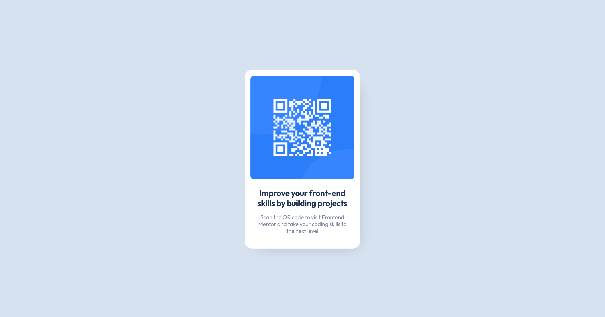

# Frontend Mentor - QR code component solution

This is a solution to the [QR code component challenge on Frontend Mentor](https://www.frontendmentor.io/challenges/qr-code-component-iux_sIO_H). Frontend Mentor challenges help you improve your coding skills by building realistic projects. 

## Table of contents

- [Overview](#overview)
  - [Screenshot](#screenshot)
  - [Links](#links)
- [My process](#my-process)
  - [Built with](#built-with)
- [Author](#author)
- [Acknowledgments](#acknowledgments)

## Overview

### Screenshot

### Links

- Solution URL: [Add solution URL here](https://your-solution-url.com)
- Live Site URL: [Add live site URL here](https://your-live-site-url.com)

## My process

### Built with

- Semantic HTML5 markup
- Flexbox
- CSS Grid
- Mobile-first workflow

## Author

- Website - [Eric Salvi](https://github.com/ericsalvi)
- Frontend Mentor - [@ericsalvi](https://www.frontendmentor.io/profile/ericsalvi)

## Acknowledgments

This was actually done as a challenge that @maiaflow did recently. A 1-hour challenge to complete this from beginning to end. I did that in under 60 minutes as we speak. This was a great way to push yourself into getting one of these completed in that timeframe. 